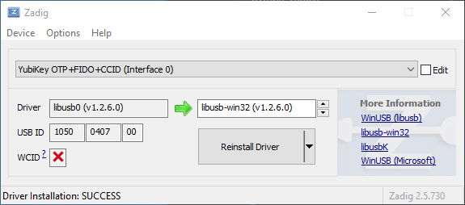

# toolship

Toolship is a tiny extensible Qt-based command console.

## Windows YubiKey Setup

In order to connect to the YubiKey, PyUSB (which is used by python-yubico) is using LibUSB, which
in turn requires that the YubiKey driver is first installed (see [this](https://stackoverflow.com/a/39833322/791713))
StackOverflow answer). Whats appears to be the simplest method is to

* Make sure LibUSB is installed (e.g. you can go via [SourceForge](https://sourceforge.net/projects/libusb-win32/files/)
  or via [GitHub](https://github.com/libusb/libusb/releases)) and PyUSB does not complain about
  "no backend available".
* Use [Zadig](https://zadig.akeo.ie/) to install the YubiKey driver into libusb-win32

    

---

Copyright &copy; 2021 Niklas Rosenstein

