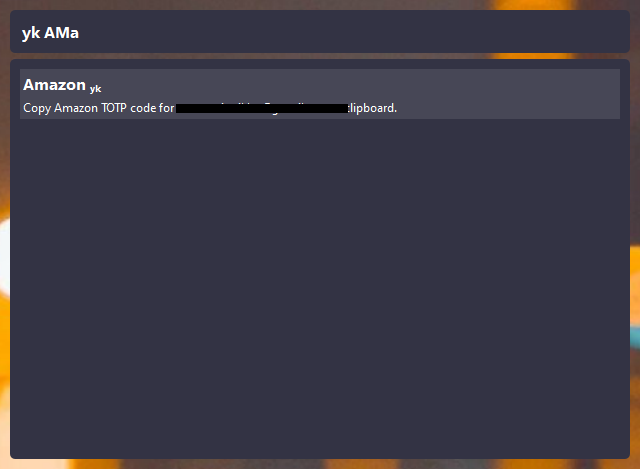

# toolship

Toolship is a user-friendly, open source, extensible and open-source command console.

> Screenshot of *toolship-qt* which by default can be summoned with `Ctrl`+`Alt`+`Space`.

To find out more about Toolship, check out

* toolship-core
* toolship-qt
* toolship-yubikey

---

Copyright &copy; 2021 Niklas Rosenstein

